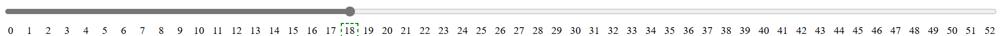
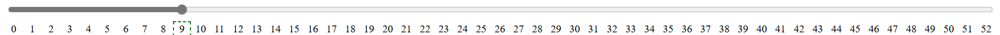
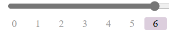
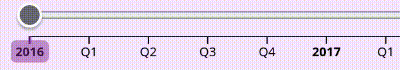
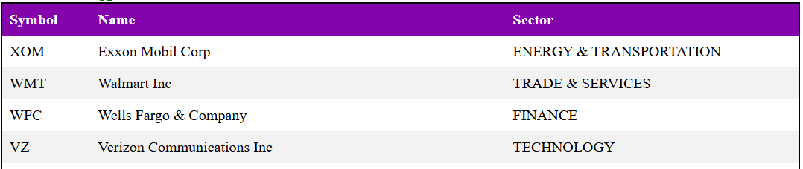
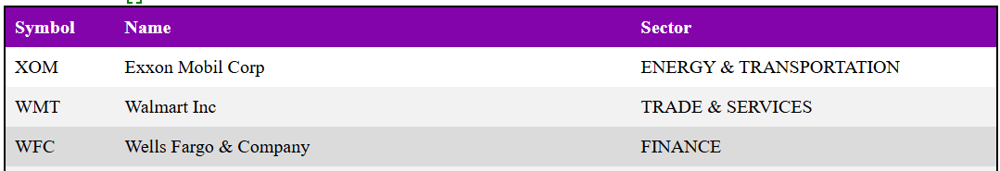
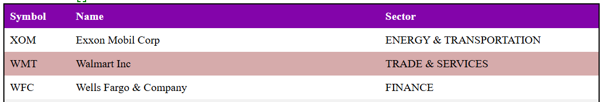
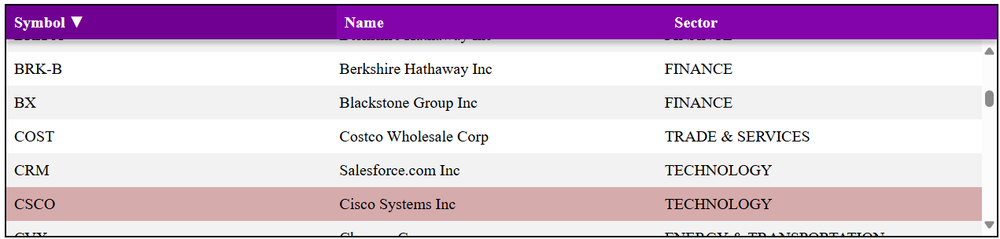
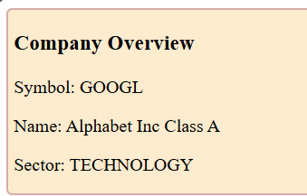
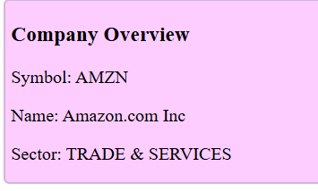

# Process Book

## Table of Contents

Below is the table of contents for the process book.

- [Data Serving](#data-serving)
- [Global State](#global-state)
- [Data Collection](#data-collection)
- [Date Slider](#date-slider)
- [Company Selection Table](#company-selection-table)
- [Company Overview](#company-overview)
- [Speedometer](#speedometer)
- [Bubble Chart (optional feature)](#bubble-chart-optional-feature)
- [Word Cloud](#word-cloud)
- [Radar Chart (optional feature)](#radar-chart-optional-feature)
- [Cash Flow / Balance Sheet / Income Statement](#cash-flow--balance-sheet--income-statement)
- [Complete Page](#complete-page)

<!-- Page Break in PDF -->

## Data Serving

The backend uses a `node.js` and `express.js` backend. We went with this method due to having prior experience on the team, as well as being able to serve from SQL queries, improving the speed of data collection, aggregation, and use. We also used a compiler to allow use of ES6 and multi-file frontend for ease of development and code readability.

## Global State

After initializing the selection table, we realized we needed a way to update all the visuals interactively and efficiently. We developed a custom event bus that could accept listeners for custom events, such as updating quarters and the selected company, and would dispatch events when the global state it stored was updated. This allowed us to make the visuals more dynamic and based on a current global state controlled by multiple visual elements.

## Data Collection

### Data Sources and Collection

We collected our financial data primarily from the [Alpha Vantage API](https://www.alphavantage.co/). The website provided us with a diverse range of financial information including company overviews, financial statements -income statements, cash flows, balance sheets-, stock prices, news articles and sentiments attached to the company. We developed a data collection pipeline in python to fetch, process and store the collected data.

### Collection Infrastructure

We implemented several strategies to overcome the API rate limitations of 25 calls per day potentially by adding waits between api calls, and automating generation of new api keys when needed.

1. **API Key Management** : We have a key management python class that can generate, store, rotate and use API keys when needed.
2. **Retry Logic** : We have implemented retry mechanisms by waiting / rotating to new key / generating another key in our fetch data functions.

### Data Types Collected

We have collected several types of financial data.

1. **Symbols** : We created a list of top 60 companies based on Market Cap that we are doing all the data collection for.
1. **Company Overview** : Basic company information that includes symbol, name, description, sector, industry, market cap, etc.

1. **Financial Statements** : We collected the below in quarterly and annually basis
   - Income Statements
   - Balance Sheets
   - Cash Flow
1. **Stock Price** : Intraday prices at 60 minute intervals, collected for years 2016 to 2025

1. **News Articles** : We collected news articles with their related market sentiment scores for the 60 companies.

### Data Processing and Storage

The steps for data collection were:

1. Check to see if the data for that symbol already exists.
1. If the data does not exist, fetch the data by calling the api with correct parameters.
1. Store the data in the corresponding sql table in a SQLite database called `finance_data.db`.
1. For analysis and backup, we also exported our tables as csv files.

Our `finance_data.db` contains tables :
`company_overview`, `company_intraday_data`, `balance_sheet`, , `income_statement`, `cash_flow`, `news_articles`, `news_ticker_sentiment`

### Data Cleaning

Before we store the data in the database, we perform certain preprocessing on it:

- Handling missing values by putting them as `null`
- Ensuring proper data formatting for time series data
- Have correct primary and foreign for our sql tables.

This comprehensive dataset provides the foundation for our project, enabling the analysis across multiple features including financial performance, market sentiment, and stock price movement.

<!-- Page Break in PDF -->
<!-- TODO: Add back in if needed -->

## Date Slider

This is the visual for selecting the quarter and year, as well as whether to look at a quarter or an entire year of data.

### Initial Design

First iteration was to allow functionality only. We went with a raw html look, and used D3 to generate a table where each cell represented a ticker. The border of the selected cell would be highlighted as the slider was moved, simulating highlighted text tickers at each step. This will later be updated to use d3 axis, spaced in the same manner.

This step does not account for actual dates, but sets the groundwork for adding quarters and years under each ticker for future selection. While we do have dates for the data that can be selected, the dates have gaps and are unknown as of this entry. Once the dates are better known for the full data set, we will add dates in place of the current arbitrary numeric selection. Additionally, the slider text tickers are not properly centered on all ticker counts or screen widths. This needs to be updated to accommodate more screen sizes.

### CSS Upgrade

We updated the slider to add a more modern and easy to read view. A rounded highlight of the selected tick plus a de-saturated text color on un-selected ticks makes it much easier to identify the current selection. We also made it purple to go with the overall color scheme we are aiming towards.

This update uses d3 to generate a table, but does not make use of d3 axis, which is the aim for future iterations to add better transition support.

### D3 Axis

This version upgrades the HTML grid layout to a D3 x-axis for an SVG. The slider is overlayed without grids and uses padding instead. This allows for a much better looking axis with a horizontal bar, as well as better control over the text within the axis.

This better control was also used to display the year / quarter being selected. To allow users to select both years and individual quarters, we put years as a tick, and the quarters assigned to those years follow as 4 seperate ticks. This makes it clear which quarter of the year they selected, or if they selected the entire year instead, without the need for a second selection menu or bar.

Additionally, the slider now uses transitions. Rather than rebuilding the entire visual every time there is an update, we reuse the same elements and take advantage of CSS classes to use CSS files instead of setting attributes within the JS itself. This allows for more organized code, while still having the power of D3 transitions.

The color scheme is the same, but the years are in bold to make it obvious to the user if they selected a year or a quarter.

<!-- Page Break in PDF -->

## Company Selection Table

This visual displays all the companies we have data for, and allows users to sort by the displayed columns, and select a company. When a company is selected, it updates the global state which causes all other visuals to represent data for that company instead.

### Initial Design

First iteration of the table only relies on the Symbol data to exist. The creation function will add headers for any columns in the result, but `Symbol` is used to update the global state. We used d3 to generate the headers from the object keys, and to generate all following rows from the data each object had under those keys. This table can also be sorted by clicking the header cells, sorting by the column and changing the direction (ascending / descending).

We also have the ability to display which row is hovered over

And the ability to click a box and highlight the selected entry with a different color

### CSS Upgrades

The next iteration involved upgrading the CSS to make it feel more interactive. We added arrows to display the direction the user was sorting the companies, and by which column. We also added a darker shade of purple to show which header the user would be clicking. On top of that, we also shrunk the table to be only 200px tall, and made it scrollable. This allows us to fit more visuals on the page, while still letting users select from the entire set of provided companies.

<!-- Page Break in PDF -->

## Company Overview

This displays textual information about the currently selected company.

### Initial Design

Currently it displays all entries from the SQL query made. This means that by changing the query, we will automatically add that data to the overview. The current design is as shown:

We will also aim for a better, more defined color scheme in the future, but for now we have a functional prototype that displays queried data. We will add more to the query in the future to better connect information for the visuals on the page.

### Color Scheme Update

We updated the CSS to make it purple. This allows it to better fit with the purple-oriented color scheme we went with for the table and slider visuals.

<!-- Page Break in PDF -->

## Speedometer

This visual represents a key metric of the selected company, by using a semi-circular dial to show the sentiment of the particular company based on news articles.

### Initial Design

We created a dynamic gauge using D3, where the needle rotates to point to the value corresponding to the current company’s sentiment. The value range is divided into five color-coded sections to indicate performance zones: red (low), orange (moderate low), yellow(neutral), light green (moderate high), and green (high). This 5-bin setup matches with the Bearish to Bullish sentiment bins provided from our collected data structure.

This initial design is no connected to data from the database. While we have collected and stored the data in the backend database, we have not created the connection between the backend and frontend to facilitate updating it with the currently selected company. As such, the updates to the global state make no affect on the visual just yet, even though the data is present in the database.

<!-- Page Break in PDF -->

## Bubble chart (optional feature)

This visual shows multiple company sectors as bubbles, where the size and color of each bubble indicate the magnitude and category of the sector.

**_Note:_** This design is optional _(Gradescope comment on project proposal)_. The d3 design has been started, but there is no data collected for this visual. If we have the time, we will collect and add the relevant data to the database and complete the visual with the collected data. If not, the visual will be excluded from the final project submission.

### Initial Design

We used d3.pack() to generate non-overlapping bubbles. Each bubble represents a metric (like Revenue, Profit, etc.), with its size scaled based on the value of that metric. We categorized each value into one of four groups and assigned them colors: Green for high values, Light green for moderately high values, Light red for moderately low values & Red for low values

<!-- Page Break in PDF -->

## Word Cloud

This visual displays prominent keywords associated with the selected company in a cloud layout from the news articles published for each company.

### Initial Design

We created a word cloud using D3, with font sizes mapped to the importance or frequency of each term. The more significant the word, the larger and bolder it appears. To make the visual we used the `d3-cloud` library, as it vastly reduced the amount of work needed to generate the word cloud visual.

This chart listens to the global symbol state and updates accordingly. For the prototype, we are currently using static/mock data, but it is set up to integrate with dynamic keyword generation based on backend values. However, we are still connecting it to the global state, providing new orientations of the provided words when the global selected symbol is updated.

The backend has a list of words available for the visual, but the query connection has not been set up and will be implemented in the future to replace the previously mentioned static data.

This word cloud was initially meant to be combined with the speedometer visual, creating a visually compelling combination of important words highlighted by sentiment and the total sentiment for that company.

However, this has turned out to be a very difficult task. To simplify the task, we have split the visual into 2 separate visuals of the word cloud and the speedometer for overall sentiment. We will continue to aim for the combined visual if possible as it is much more appealing, but we also understand the difficulty this may pose to completing the project on time.

<!-- Page Break in PDF -->

## Radar Chart (optional feature)

This visual compares sector-wise cash flow distribution for the selected company.

**_Note:_** This design is optional _(Gradescope comment on project proposal)_. The d3 design has been started, but there is no data collected for this visual. If we have the time, we will collect and add the relevant data to the database and complete the visual with the collected data. If not, the visual will be excluded from the final project submission.

### Initial Design

We implemented the radar chart using radial lines and concentric circles to represent six key sectors. Each axis represents a sector, and the values (normalized between 0 and 1) form a closed polygon representing the distribution of cash flow across those sectors.

The text size on the radar chart will need to be increased for readability and scale, and the current variables on the radar chart will likely need to be updated and modified to better fit the data once we collect it.

<!-- Page Break in PDF -->

## Cash Flow / Balance Sheet / Income Statement

**Cash Flow:** The cash flow chart represents how much cash a company brings in and how it gets spent.

**Balance Sheet:** The balance sheet chart represents how company assets compare to their liabilities and equity.

**Income Statement:** The income statement chart represents how sold products or services are bringing in revenue and how much of that gets spent vs becomes profit within a particular company.

### Initial Design

The data for the cash flow graph is computed on the backend. We use an SQL query to convert a list of revenue sources and expenditures into a data object with sources and targets that a sankey graph will be able to visualize, without any data processing on the client side.

To make the visual, we utilized the `d3-sankey` library. This library takes a particular data input format which we used as the output format of our previously described SQL query.

<!-- Page Break in PDF -->

### Cash Flow Chart

<!-- Page Break in PDF -->
<!-- 

 -->

### Balance Sheet Chart

<!-- Page Break in PDF -->

### Income Statement Chart

The sankey graphs do contain all of the necessary data, and they do update with the global state on a change of the currently selected company. However we have not set up the date slider to update with real dates, and as such we are assuming a constant date with a company symbol as the sole parameter.

To improve the sankey visual for all 3 charts and remove overlapping text, we need to modify the SQL query to make it better represent company data in this graph format. The client side d3 directly prints the retrieved data, so to make the graph more readable we will need to decide on a better SQL query to improve the format of the graph. However, the data in the SQL table we are pulling from is in the correct format to allow us to make such arbitrary updates to the query.

Additionally, we want to take all 3 visuals and merge them into a single visual that can be swapped between with a selection box.

<!-- Page Break in PDF -->

## Complete Page

This describes the process of joining the above visuals together, how we went about it, and why.

### Initial Design

The initial design we went with was to not worry about how the visuals were connected on screen as much as if they were on the screen at all. As such, we stacked a bunch of divs on top of each other to get them on the screen:

This design is obviously heavily flawed. When updating the selections at the top, you cannot view the changes without a lot of scrolling. To improve this, we need to add side-by-side visuals such as the speedometer and word cloud, and the company overview with the stock graph. Additionally, we want to combine the sankey diagrams into a single div that will be able to be swapped between with a selection box. This will vastly reduce clutter and user frustration from the current design.

However for designing individual visuals prior to working with the entire context of the page, this approach allowed us to focus on the visuals over the webpage for now, and therefore the design accomplished its task.

[Complete Page](#first-full-page)

<!-- Page Break in PDF -->

### First Full Page

