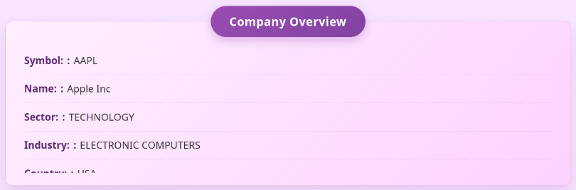

# Process Book

## Table of Contents

Below is the table of contents for the process book.

- [Data Serving](#data-serving)
- [Global State](#global-state)
- [Data Collection](#data-collection)
- [Error Message](#error-message)
- [Date Slider](#date-slider)
- [Company Selection Table](#company-selection-table)
- [Company Overview](#company-overview)
- [Intraday Chart](#intraday-chart)
- [Speedometer](#speedometer)
- [Word Cloud](#word-cloud)
- [Bubble Chart (optional feature)](#bubble-chart-optional-feature)
- [Radar Chart (optional feature)](#radar-chart-optional-feature)
- [Cash Flow / Balance Sheet / Income Statement](#cash-flow--balance-sheet--income-statement)
- [Website Header](#website-header)
- [Complete Page](#complete-page)

<!-- Page Break in PDF -->
<div style="page-break-before: always;"></div>

## Data Serving

The backend uses a `node.js` and `express.js` backend. We went with this method due to having prior experience on the team, as well as being able to serve from SQL queries, improving the speed of data collection, aggregation, and use. We also used a compiler to allow use of ES6 and multi-file frontend for ease of development and code readability.

## Global State

After initializing the selection table, we realized we needed a way to update all the visuals interactively and efficiently. We developed a custom event bus that could accept listeners for custom events, such as updating quarters and the selected company, and would dispatch events when the global state it stored was updated. This allowed us to make the visuals more dynamic and based on a current global state controlled by multiple visual elements.

## Data Collection

### Data Sources and Collection

We collected our financial data primarily from the [Alpha Vantage API](https://www.alphavantage.co/). The website provided us with a diverse range of financial information including company overviews, financial statements, income statements, cash flows, balance sheets, stock prices, news articles and sentiments attached to the company. We developed a data collection pipeline in python to fetch, process and store the collected data.

### Collection Infrastructure

We implemented several strategies to overcome the API rate limitations of 25 calls per day potentially by adding waits between api calls, and automating generation of new api keys when needed.

1. **API Key Management** : We have a key management python class that can generate, store, rotate and use API keys when needed.
2. **Retry Logic** : We have implemented retry mechanisms by waiting / rotating to new key / generating another key in our fetch data functions.

### Data Types Collected

We have collected several types of financial data.

1. **Symbols** : We created a list of top 60 companies based on Market Cap that we are doing all the data collection for.
1. **Company Overview** : Basic company information that includes symbol, name, description, sector, industry, market cap, etc.

1. **Financial Statements** : We collected the below in quarterly and annually basis
   - Income Statements
   - Balance Sheets
   - Cash Flow
1. **Stock Price** : Intraday prices at 60 minute intervals, collected for years 2016 to 2025

1. **News Articles** : We collected news articles with their related market sentiment scores for the 60 companies.

### Data Processing and Storage

The steps for data collection were:

1. Check to see if the data for that symbol already exists.
1. If the data does not exist, fetch the data by calling the api with correct parameters.
1. Store the data in the corresponding sql table in a SQLite database called `finance_data.db`.
1. For analysis and backup, we also exported our tables as csv files.

Our `finance_data.db` contains tables :
`company_overview`, `company_intraday_data`, `balance_sheet`, , `income_statement`, `cash_flow`, `news_articles`, `news_ticker_sentiment`

### Data Cleaning

Before we store the data in the database, we perform certain preprocessing on it:

- Handling missing values by putting them as `null`
- Ensuring proper data formatting for time series data
- Have correct primary and foreign for our sql tables.

This comprehensive dataset provides the foundation for our project, enabling the analysis across multiple features including financial performance, market sentiment, and stock price movement.

<!-- Page Break in PDF -->
<div style="page-break-before: always;"></div>

## Error Message

Not all companies have available data for all the data points we need. We collected all the data we could find regarding these 60 companies, and compiled all data available. However, we need to display to the user if we are missing data for certain visuals when certain times and companies are selected. To account for this, we made an error message class that can be appended to any SVG, and will transition in using the global duration suggestion when there is missing data. This provides the user with consistency in data errors, and small amounts of customizability for us in the direction we choose the error message to enter from.

<center>

</center>

We may update the CSS for this later to be more appealing and more visually an error, but for now we are using this in all visuals when an error in missing data arises.

<!-- Page Break in PDF -->
<div style="page-break-before: always;"></div>

## Date Slider

This is the visual for selecting the quarter and year, as well as whether to look at a quarter or an entire year of data.

### Initial Design

First iteration was to allow functionality only. We went with a raw html look, and used D3 to generate a table where each cell represented a ticker. The border of the selected cell would be highlighted as the slider was moved, simulating highlighted text tickers at each step. This will later be updated to use d3 axis, spaced in the same manner.


This step does not account for actual dates, but sets the groundwork for adding quarters and years under each ticker for future selection. While we do have dates for the data that can be selected, the dates have gaps and are unknown as of this entry. Once the dates are better known for the full data set, we will add dates in place of the current arbitrary numeric selection. Additionally, the slider text tickers are not properly centered on all ticker counts or screen widths. This needs to be updated to accommodate more screen sizes.

### CSS Upgrade

We updated the slider to add a more modern and easy to read view. A rounded highlight of the selected tick plus a de-saturated text color on un-selected ticks makes it much easier to identify the current selection. We also made it purple to go with the overall color scheme we are aiming towards.

<center>

</center>

This update uses d3 to generate a table, but does not make use of d3 axis, which is the aim for future iterations to add better transition support.

### D3 Axis

This version upgrades the HTML grid layout to a D3 x-axis for an SVG. The slider is overlayed without grids and uses padding instead. This allows for a much better looking axis with a horizontal bar, as well as better control over the text within the axis.

This better control was also used to display the year / quarter being selected. To allow users to select both years and individual quarters, we put years as a tick, and the quarters assigned to those years follow as 4 seperate ticks. This makes it clear which quarter of the year they selected, or if they selected the entire year instead, without the need for a second selection menu or bar.

<center>

</center>

Additionally, the slider now uses transitions. Rather than rebuilding the entire visual every time there is an update, we reuse the same elements and take advantage of CSS classes to use CSS files instead of setting attributes within the JS itself. This allows for more organized code, while still having the power of D3 transitions.

The color scheme is the same, but the years are in bold to make it obvious to the user if they selected a year or a quarter.

<!-- Page Break in PDF -->
<div style="page-break-before: always;"></div>

## Company Selection Table

This visual displays all the companies we have data for, and allows users to sort by the displayed columns, and select a company. When a company is selected, it updates the global state which causes all other visuals to represent data for that company instead.

### Initial Design

First iteration of the table only relies on the Symbol data to exist. The creation function will add headers for any columns in the result, but `Symbol` is used to update the global state. We used d3 to generate the headers from the object keys, and to generate all following rows from the data each object had under those keys. This table can also be sorted by clicking the header cells, sorting by the column and changing the direction (ascending / descending).


We also have the ability to display which row is hovered over


And the ability to click a box and highlight the selected entry with a different color


### CSS Upgrades

The next iteration involved upgrading the CSS to make it feel more interactive. We added arrows to display the direction the user was sorting the companies, and by which column. We also added a darker shade of purple to show which header the user would be clicking. On top of that, we also shrunk the table to be only 200px tall, and made it scrollable. This allows us to fit more visuals on the page, while still letting users select from the entire set of provided companies.


<!-- Page Break in PDF -->
<div style="page-break-before: always;"></div>

## Company Overview

This displays textual information about the currently selected company.

### Initial Design

Currently it displays all entries from the SQL query made. This means that by changing the query, we will automatically add that data to the overview. The current design is as shown:

<center>

</center>

We will also aim for a better, more defined color scheme in the future, but for now we have a functional prototype that displays queried data. We will add more to the query in the future to better connect information for the visuals on the page.

### Color Scheme Update

We updated the CSS to make it purple. This allows it to better fit with the purple-oriented color scheme we went with for the table and slider visuals.

<center>

</center>

### Title Bar Reposition

The new Company Overview visual moves the title of the visual to the top center, and hovers it over the box to give it a more interesting look without covering any important information. The title also takes advantage of box-shadows to give it a 3D look. We also made the labels bold to help identify them from the values they define.

<center>

</center>

### CSS Upgrades

We decided to overhaul the design with CS, implementing a new complex set of rules. This gives it a more modern look while being more interesting to look at.

<center>

</center>

<!-- Page Break in PDF -->
<div style="page-break-before: always;"></div>

## Intraday Chart

The intraday chart displays stock prices over a period of time. The current design is a basic line chart with tome on the x-axis and the stock price on the y-axis. While this is a common practice, that is because it is the most effective, and will allow the greatest number of people to understant the stock price over the selected time period.

### Initial design

The colors do not entirely fit in the current color scheme, so we will need to fix that later. Additionally, there are no transitions, so we will want to add a transition to the chart for a more effective and visually helpful experience. However, the chart does fulfill the basic requirenments, and can take in any data set with a group of times and convert it into a valid line chart. As such, we can use both annual and quarterly data to display in the chart.

<center>

</center>

### Transitions

We have now added transitions. The chart looks the same, but the added transitions make it feel more responsive and user friendly.

### Error Message

We added the custom error message to the intraday chart, having it enter from the right on no data. Additionally, when there is an error, it transitions the intraday line so it goes from the previous value to 0 for a smooth error transiton.

<center>

</center>

There is very little missing data on the intraday from the selections we are limited too, but this will account for any we may not know about.

### Axis Formatting

On the x-axis, we changed it so the quarterly data has a different tick format than the annual since the quarterly has multiple ticks per month. The annual version eliminates the day from the tick format as every month has only 1 tick.We used d3 to format the y-axis with the `"~s"` format to trim out long numbers and use `'k'` as a valid value for thousand. This reduces long numbers, improves readability, and allows users an easier time understanding the axis values. We also added axis labels so users will understand the legend of what is happening with the one line on the visual.

<!-- Page Break in PDF -->
<div style="page-break-before: always;"></div>

#### Annual

<center>

</center>

#### Quarterly

<center>

</center>

### Hover Interactions

Based on the HW4 interactions, we implemented a similar line chart overlay to allow the user to see exactly what price was at what time. Since some price points are missing from the data set, we find the price closest to the hovered portion in the future and display it on the overlay line. Additionally, we added a purple, transparent dashed line to show the user exactly what part of the graph they were being shown compared to the y-axis.

<center>

</center>

<!-- Page Break in PDF -->
<div style="page-break-before: always;"></div>

## Speedometer

This visual represents a key metric of the selected company, by using a semi-circular dial to show the sentiment of the particular company based on news articles.

### Initial Design

We created a dynamic gauge using D3, where the needle rotates to point to the value corresponding to the current company’s sentiment. The value range is divided into five color-coded sections to indicate performance zones: red (low), orange (moderate low), yellow(neutral), light green (moderate high), and green (high). This 5-bin setup matches with the Bearish to Bullish sentiment bins provided from our collected data structure.

<center>

</center>

This initial design is no connected to data from the database. While we have collected and stored the data in the backend database, we have not created the connection between the backend and frontend to facilitate updating it with the currently selected company. As such, the updates to the global state make no affect on the visual just yet, even though the data is present in the database.

### Data Connection

We upgraded the speedometer to connect to the database. Now it will update the angle of the needle based on the sentiment value of the selected year / quarter as well as the current company. We are aiming to add text specifying the names (Bearish / Neutral / Bullish) of the different bins to have an option other than just color, but for now the color will indicate the sentiment score to the user.

In addition to the data connection, we made the speedometer take up the majority of the SVG. It does look a bit thin and we will try out a few more options for making it look good, but for now it is centered and looks more professional than the initial design.

<center>

</center>

### Errors

Since we are unable to get data for some companies during specific years / quarters, we need an effective way to indicate there is no data for the current selection. We reused the custom error message from the intraday visual, and had the error message float in from the left, as the visual is on the left side of the screen. The needle will also turn a dark shade of red to indiacte that the zeroed out position represents invalid data, in addition to the error message.

<center>

</center>

<!-- Page Break in PDF -->
<div style="page-break-before: always;"></div>

### Color Blindness

To make it more friendly to the eyes and better for color blindness, we updated the sentiment colors to a blue-red theme. This theme is also closer in color theme to the rest of the website, and feels more put together.

<center>

</center>

<!-- Page Break in PDF -->
<div style="page-break-before: always;"></div>

## Word Cloud

This visual displays prominent keywords associated with the selected company in a cloud layout from the news articles published for each company.

### Initial Design

We created a word cloud using D3, with font sizes mapped to the importance or frequency of each term. The more significant the word, the larger and bolder it appears. To make the visual we used the `d3-cloud` library, as it vastly reduced the amount of work needed to generate the word cloud visual.

This chart listens to the global symbol state and updates accordingly. For the prototype, we are currently using static/mock data, but it is set up to integrate with dynamic keyword generation based on backend values. However, we are still connecting it to the global state, providing new orientations of the provided words when the global selected symbol is updated.

The backend has a list of words available for the visual, but the query connection has not been set up and will be implemented in the future to replace the previously mentioned static data.

<center>

</center>

This word cloud was initially meant to be combined with the speedometer visual, creating a visually compelling combination of important words highlighted by sentiment and the total sentiment for that company.

<center>

</center>

However, this has turned out to be a very difficult task. To simplify the task, we have split the visual into 2 separate visuals of the word cloud and the speedometer for overall sentiment. We will continue to aim for the combined visual if possible as it is much more appealing, but we also understand the difficulty this may pose to completing the project on time.

### Data Connection

We connected the word cloud to the backend database. The query gets the top 10 most used words from news articles, and uses a `d3.scaleLinear()` to map the lowest count word to `15px` and the highest count word to `70px`. The colors are also retrieved from the database, and colored based on individual sentiment scores for the articles that word is associated with in regards to the company selected during the time period selected.

<center>

</center>

<!-- Page Break in PDF -->
<div style="page-break-before: always;"></div>

### Color Blindness

To make it more friendly to the eyes and better for color blindness, we updated the sentiment colors to a blue-red theme. This theme is also closer in color theme to the rest of the website, and feels more put together.

<center>

</center>

<!-- Page Break in PDF -->
<div style="page-break-before: always;"></div>

## Bubble chart (optional feature)

This visual shows multiple company sectors as bubbles, where the size and color of each bubble indicate the magnitude and category of the sector.

**_Note:_** This design is optional _(Gradescope comment on project proposal)_. The d3 design has been started, but there is no data collected for this visual. If we have the time, we will collect and add the relevant data to the database and complete the visual with the collected data. If not, the visual will be excluded from the final project submission.

### Initial Design

We used d3.pack() to generate non-overlapping bubbles. Each bubble represents a metric (like Revenue, Profit, etc.), with its size scaled based on the value of that metric. We categorized each value into one of four groups and assigned them colors: Green for high values, Light green for moderately high values, Light red for moderately low values & Red for low values

<center>

</center>

<!-- Page Break in PDF -->
<div style="page-break-before: always;"></div>

### Removal

Due to the time constraints of the class, we were not able to collect enough data to make use of the chart and we have removed it from the final design.

<!-- Page Break in PDF -->
<div style="page-break-before: always;"></div>

## Radar Chart (optional feature)

This visual compares sector-wise cash flow distribution for the selected company.

**_Note:_** This design is optional _(Gradescope comment on project proposal)_. The d3 design has been started, but there is no data collected for this visual. If we have the time, we will collect and add the relevant data to the database and complete the visual with the collected data. If not, the visual will be excluded from the final project submission.

### Initial Design

We implemented the radar chart using radial lines and concentric circles to represent six key sectors. Each axis represents a sector, and the values (normalized between 0 and 1) form a closed polygon representing the distribution of cash flow across those sectors.

<center>

</center>

The text size on the radar chart will need to be increased for readability and scale, and the current variables on the radar chart will likely need to be updated and modified to better fit the data once we collect it.

### Removal

Due to the time constraints of the class, we were not able to collect enough data to make use of the chart and we have removed it from the final design.

<!-- Page Break in PDF -->
<div style="page-break-before: always;"></div>

## Cash Flow / Balance Sheet / Income Statement

**Cash Flow:** The cash flow chart represents how much cash a company brings in and how it gets spent.

**Balance Sheet:** The balance sheet chart represents how company assets compare to their liabilities and equity.

**Income Statement:** The income statement chart represents how sold products or services are bringing in revenue and how much of that gets spent vs becomes profit within a particular company.

### Initial Design

The data for the cash flow graph is computed on the backend. We use an SQL query to convert a list of revenue sources and expenditures into a data object with sources and targets that a sankey graph will be able to visualize, without any data processing on the client side.

To make the visual, we utilized the `d3-sankey` library. This library takes a particular data input format which we used as the output format of our previously described SQL query.

<!-- Page Break in PDF -->
<div style="page-break-before: always;"></div>

### Cash Flow Chart

<center>

</center>

<!-- Page Break in PDF -->
<!-- <div style="page-break-before: always;"></div> -->

### Balance Sheet Chart

<center>

</center>

<!-- Page Break in PDF -->
<div style="page-break-before: always;"></div>

### Income Statement Chart

<center>

</center>

The sankey graphs do contain all of the necessary data, and they do update with the global state on a change of the currently selected company. However we have not set up the date slider to update with real dates, and as such we are assuming a constant date with a company symbol as the sole parameter.

To improve the sankey visual for all 3 charts and remove overlapping text, we need to modify the SQL query to make it better represent company data in this graph format. The client side d3 directly prints the retrieved data, so to make the graph more readable we will need to decide on a better SQL query to improve the format of the graph. However, the data in the SQL table we are pulling from is in the correct format to allow us to make such arbitrary updates to the query.

Additionally, we want to take all 3 visuals and merge them into a single visual that can be swapped between with a selection box.

### Joined Chart

We took all 3 visuals and combined them into a single, large chart. This will allow users to have a less cluttered screen as we can now have only one sankey chart visible, chosen by the user, and the grid can be 2x3 which reduces the required width. We accomplished this by making a single chart script that takes in a generic sankey graph data input and generates it from that. We combined the list of colors as well, so regardless of the type it will use those colors, inverting them if there are negative values in the input. All values that are 0 are also removed, removing the issue of grouped titles in the corner that had no visible nodes or links.

The chart below shows the negative values. Gross profit is green, but this implies that the gross profit was actually negative, and the company was running at a loss in profits. The total revenue did come in, but all profits were spent and considered as leaving the company bank rather than going in.

<center>

</center>

### Dropdown

To allow users the ability to choose which chart they want to view, we added a dropdown above the sankey graph in the center. This makes it easy to spot and keeps it out of the way of the visual itself. The one downside is it takes up some of the alloted height of the grid row, but we can add more height to it if it appears to becomes overcrowded.

<center>

</center>

<center>

</center>

<center>

</center>

### Query Updates

In previous versions, the 3 different charts had queries that returned the set of connections from node A to node B in the chart and the value id held. This allowed us to make the sankey graph directly from queried data. However, not all the data aggregation was used in the right order. We fixed the ordering which helped make the data feel complete and organized for the user as well as made it accurate. While the sankey graph does have some nodes that are larger than their inputs, the data collection only was able to collect certain portions of cash flow, income statement, and balance sheet data based on what the API gave us. The nmumbers for these charts do not line up perfectly for reasons we are investigating, but is most likely due to missing data that was not accounted for in the sheets we obtained. The image below represents our best efforts to get it to line up based on available collected data.

<center>

</center>

<center>

</center>

<center>

</center>

### Hover View

Because the sankey graph does not have raw values labeled anywhere, we have added the ability to hover over individual sankey nodes to display the associated values with those nodes. It also accounts for nodes that have negative values, making sure users can see that the value is being taken out rather than added like it would normally be.

<center>

</center>

<center>

</center>

<!-- Page Break in PDF -->
<div style="page-break-before: always;"></div>

## Website Header

After some thought, we realized that the visuals on their own may not be understood by everyone looking at them. To correct for this, we've added a header and information cards to provide users with descriptions of each visual to help navigate the page.

<center>

</center>

<!-- Page Break in PDF -->
<div style="page-break-before: always;"></div>

## Complete Page

This describes the process of joining the above visuals together, how we went about it, and why.

### Initial Design

The initial design we went with was to not worry about how the visuals were connected on screen as much as if they were on the screen at all. As such, we stacked a bunch of divs on top of each other to get them on the screen:

This design is obviously heavily flawed. When updating the selections at the top, you cannot view the changes without a lot of scrolling. To improve this, we need to add side-by-side visuals such as the speedometer and word cloud, and the company overview with the stock graph. Additionally, we want to combine the sankey diagrams into a single div that will be able to be swapped between with a selection box. This will vastly reduce clutter and user frustration from the current design.

However for designing individual visuals prior to working with the entire context of the page, this approach allowed us to focus on the visuals over the webpage for now, and therefore the design accomplished its task.

[Complete Page](#first-full-page)

<!-- Page Break in PDF -->
<div style="page-break-before: always;"></div>

### First Full Page

<center>

</center>

<!-- Page Break in PDF -->
<div style="page-break-before: always;"></div>

### Grid Layout

The new design of the full webpage uses a CSS grid design:

```css
#grid-wrapper {
  display: grid;
  grid-template-areas:
    "overview selection selection"
    "speedometer words stocks"
    "cash1 cash2 cash3";
}
```

This design still does not combine the 3 sankey visuals together. However, it reduces the height and combines them into 3 rows that make some semblence of sense with related information.

<center>

</center>

<!-- Page Break in PDF -->
<div style="page-break-before: always;"></div>

### Condensed Layout

Once the sankey visuals were merged into a single layout, we were able to shrink the grid to use a 2 x 3 design. This reduces the amount of clutter on the screen, and makes it more suitable for small monitors, which is the most likely size people will be using to view the webpage.

<center>

</center>

<!-- Page Break in PDF -->
<div style="page-break-before: always;"></div>

### Header Layout

Adding the headers added height to the total volume of the webpage. While this can be annoying for users to deal with, on a normal laptop they will be just a single line of information to scroll through, making it not that big of a burden.

<center>

</center>
